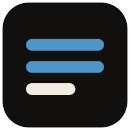
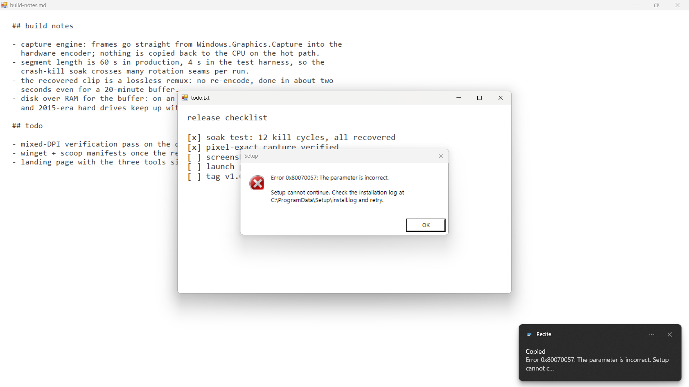

<div align="center">



# Recite

### Copy text from anything on your screen.

**Hotkey, drag, done. The words are on your clipboard,<br>even from videos, images, games, and dialogs that won't let you select.**

`one exe` · `works offline` · `no account` · `no uploads` · `no telemetry`



</div>

---

## The whole app in 10 seconds

1. **Press <kbd>Ctrl</kbd>+<kbd>PrintScreen</kbd>.** The screen freezes; windows highlight as you hover.
2. **Drag over the text**, or just click a window to take all of it.
3. **The text is on your clipboard.** A balloon shows the first line so you know it worked.

That's the entire app. Error dialogs that block selection, hardcoded subtitles, code in a YouTube tutorial, a screenshot someone posted in chat: if you can see the words, you can copy them.

**Get it:** `Recite.exe` from the [latest release](https://github.com/blancodagoat/recite/releases/latest), or `scoop bucket add blancodagoat https://github.com/blancodagoat/scoop-bucket` then `scoop install recite`.

## Why not the tools you already have?

| | The catch | Recite |
|---|---|---|
| Snipping Tool's text actions | Snip, wait for the editor, click Text actions, select, copy: five steps and a window | Hotkey, drag, done |
| PowerToys Text Extractor | Installing a fifteen-tool suite for one feature | One exe, under a megabyte |
| Capture2Text | Abandoned, bundles its own OCR models | Uses the OCR engine already inside Windows |

Recite reads with the OCR that ships in Windows itself — the newer Snipping Tool model on Windows 11, the built-in engine everywhere else — in whatever languages you have installed, entirely offline. Nothing is bundled and nothing is sent anywhere.

<details>
<summary><b>Details</b></summary>

<br>

- The hotkey is rebindable from the tray menu; the click-to-record dialog applies instantly and reverts anything Windows refuses.
- The selection overlay freezes the desktop first, so the overlay itself never ends up in the grab, and hovering highlights whole windows and individual panes for one-click capture.
- Very large multi-monitor grabs are scaled down to the OCR engine's input limit rather than refused.
- If the hotkey stops working while an admin app or game has focus, use *Restart as administrator* in the tray once; that's a Windows rule about elevated windows, not ours.
- The app never phones home. The update check in the tray menu runs only when you click it. If a grab fails, clicking the error balloon opens a prefilled GitHub issue in your browser (log tail included, usernames scrubbed) for you to review and submit — the app itself sends nothing.
- Config lives in `%APPDATA%\Recite\config.json`, and a small rolling log in the same folder records what the app did.
- Requires Windows 10 2004 or later with at least one language pack (OCR comes with them).
- On Windows 11, Recite uses the sharper OCR model that ships inside the Snipping Tool / Photos package (the one Snipping Tool's Text Actions use) — noticeably better on small text and code tokens. It loads the model out of the package on its own, with no download, and falls back to the built-in engine automatically wherever that package is absent. Set `useWindows11Ocr` to false in config to force the built-in engine.

</details>

<details>
<summary><b>Building &amp; tests</b></summary>

<br>

```
dotnet build src/Recite/Recite.csproj
dotnet run --project tests/Recite.Tests
```

The test suite includes a real OCR round trip: a known sentence is rendered into a bitmap and the Windows engine has to read it back. It runs headless, no desktop required.

</details>

---

<div align="center">

**[MIT license](LICENSE)** · part of a family with [Memento](https://github.com/blancodagoat/memento) (screenshots) and [DejaVu](https://github.com/blancodagoat/DejaVu) (instant replay)

</div>
